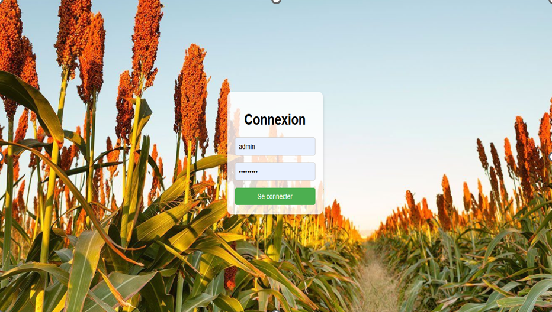
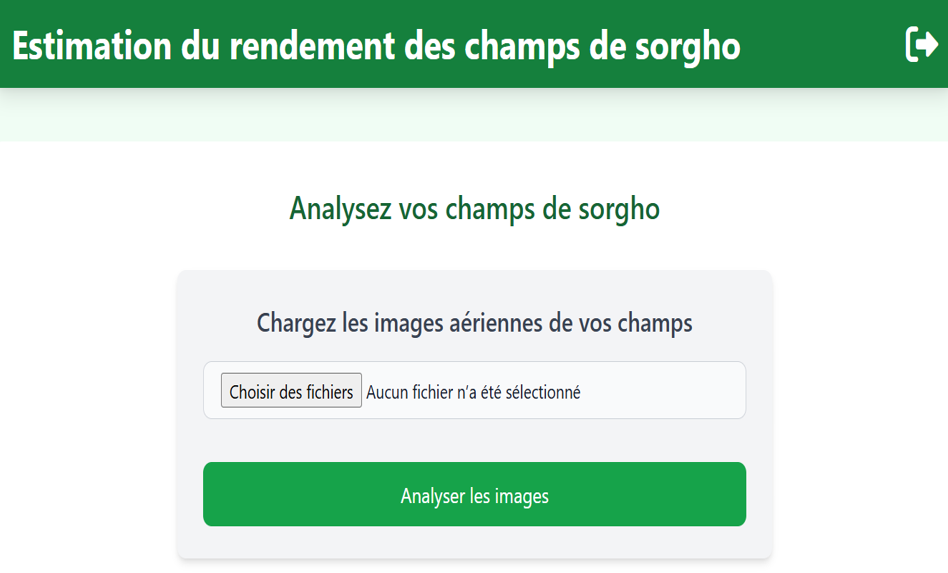
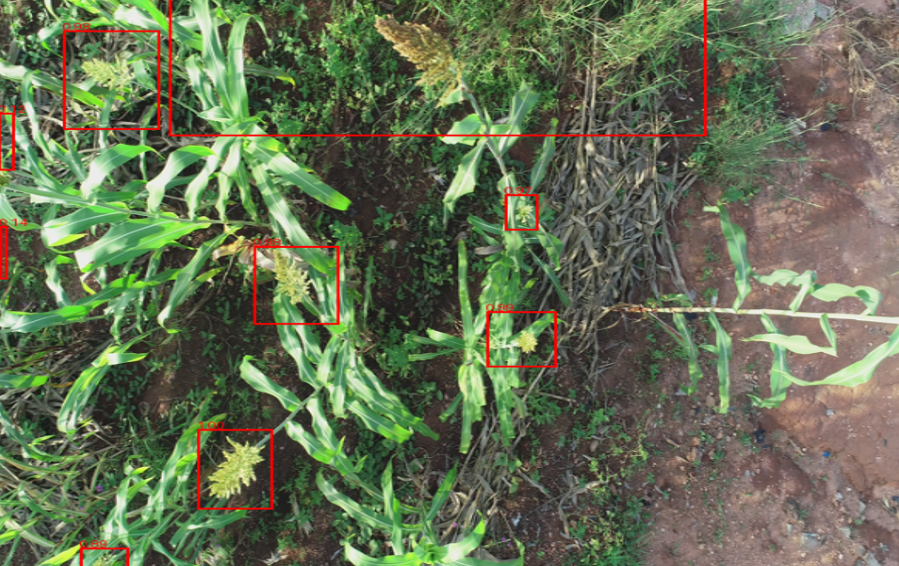
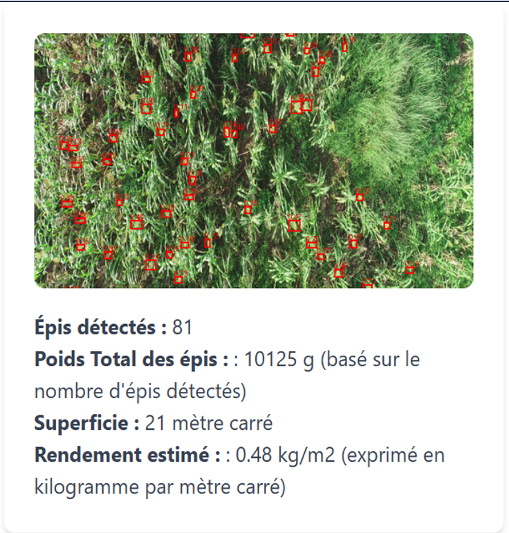

# sorgho-yield-estimation
Ce projet utilise le machine learning et la vision par ordinateur pour détecter les épis de sorgho à partir d’images aériennes et estimer le rendement agricole.

# Estimation du rendement du sorgho avec Intelligence Artificielle et images aériennes

## 📌 Description
Ce projet combine la vision par ordinateur et le développement web pour estimer le rendement du sorgho à partir d’images aériennes de champs agricoles.

Le modèle permet de détecter les épis de sorgho à différents stades de maturité et d’estimer la production agricole afin d’aider à la prise de décision.

---

## 🎯 Objectifs
- Automatiser l’analyse des champs agricoles
- Estimer le rendement du sorgho à partir d’images
- Améliorer la prise de décision agricole
- Contribuer à la sécurité alimentaire en Afrique

---

## 🧠 Architecture du projet

Le projet est composé de trois parties principales :

### 1. Modèle d’Intelligence Artificielle
- Entraîné avec TensorFlow sur Google Colab
- Basé sur la vision par ordinateur
- Détection d’épis de sorgho
- Modèle sauvegardé au format TensorFlow SavedModel

Structure :
model/
├── saved_model.pb
└── variables/

---

### 2. Données
- Images aériennes de portions de champs de sorgho
- Différents stades de maturité
- Utilisées pour entraîner et tester le modèle

---

### 3. Application Web (Django)
- Interface utilisateur simple
- Upload d’images
- Analyse via le modèle IA
- Affichage des résultats

---

## 🛠️ Technologies utilisées
- Python
- Django
- TensorFlow
- OpenCV
- NumPy
- Pandas

---

## 📁 Structure du projet

sorgho-project/
│
├── model/
│   ├── saved_model.pb
│   └── variables/
│
├── notebook/
│   └── entrainement.ipynb
│
├── app_django/
│   ├── manage.py
│   ├── app/
│   └── projet/
│
├── data/ (optionnel)
├── requirements.txt
└── README.md

---

## 🚀 Installation et exécution

### 1. Cloner le projet
git clone https://github.com/tonnom/sorgho-project.git  
cd sorgho-project  

### 2. Installer les dépendances
pip install -r requirements.txt  

### 3. Lancer l’application Django
cd app_django  
python manage.py runserver  

### 4. Accéder à l’application
http://127.0.0.1:8000/

---

## 📊 Fonctionnalités
- Upload d’image aérienne
- Détection des épis de sorgho
- Analyse automatique
- Estimation du rendement

---

## 🌍 Impact et utilité
Ce projet vise à répondre à des enjeux majeurs en Afrique :

- Amélioration de la productivité agricole  
- Aide à la prise de décision  
- Optimisation des rendements  
- Contribution à la sécurité alimentaire  

---

## 🔮 Améliorations futures
- Déploiement en ligne de l’application
- Intégration d’images satellites
- Amélioration du modèle
- Création d’une API

## 📸 Aperçu de l’application

### 🔐 Page de connexion
Interface sécurisée permettant aux utilisateurs d’accéder à l’application.

---

### 🏠 Page d’accueil
Interface principale de l’application permettant d’accéder aux fonctionnalités du système d’analyse du sorgho.

---

### 🌾 Détection des épis de sorgho
Le modèle d’intelligence artificielle détecte automatiquement les épis de sorgho dans les images aériennes.

---

### 📊 Estimation du rendement
Résultat final du système : estimation du rendement agricole à partir de l’analyse de l’image.

## 👤 Auteur
KARAMA HASSANE
Burkina Faso  
Spécialiste en Data et Intelligence Artificielle appliquée  

---

